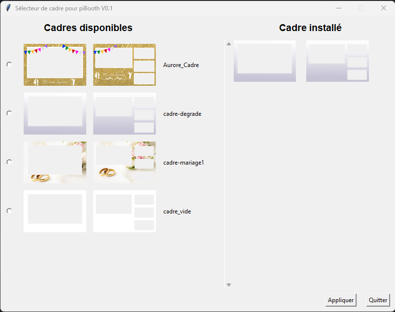
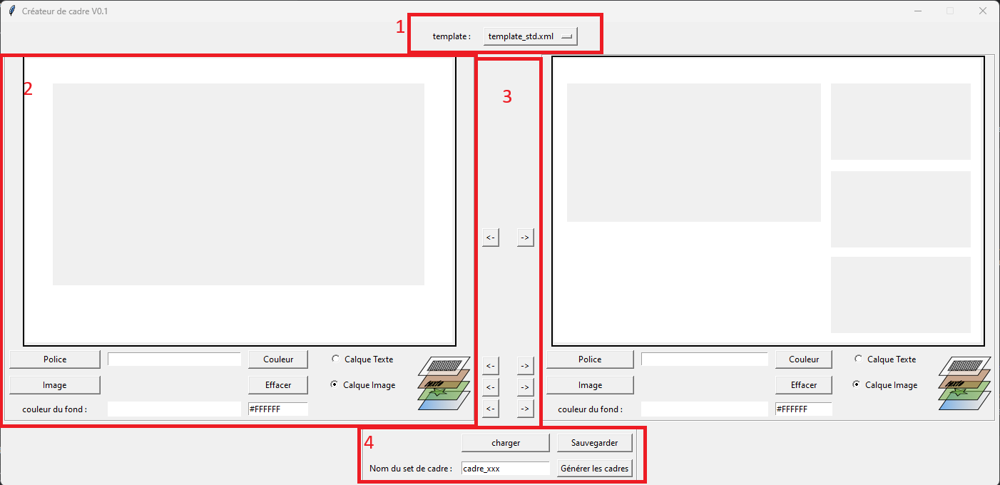

# PiBooth Cadre Sélecteur

## Introduction

L'application cadre sélecteur pour PiBooth permet, via une interface graphique, de selectionner le cadre et le layout que l'on souhaite utiliser au prochain démarrage du photomaton.
Il offre aussi la possibilité de crée un nouveau calque originaux.

## Pré-requis

Avant de lancer l'application, assurez-vous que votre système dispose des éléments suivants :

- **Python** : Version 3.7 ou supérieure.
- **Bibliothèques Python** : 
  - `tkinter`
  - `Pillow`
  - `xml.etree.ElementTree`
  - `json`
  - `shutil`

Les modules nécessaires peuvent être installés via pip :
```bash 
pip install tkinter Pillow
```

## Démarrage

Pour lancer l'application, exécutez le script Python contenant la classe `ImageEditorApp`. La fenêtre principale de l'application s'ouvrira, vous permettant de créer et de gérer vos cadres.

```bash 
python3 cadreselecteur.py
```
## Fonctionnalités

### Démarrage de l'application

1. **Initialisation** : Lors de l'exécution, l'application vérifie la présence des répertoires et du template par défaut. Les erreurs de configuration sont signalées via un message d'erreur.

- **Répertoires requis** :
  - `Templates` : Contenant les cadres et templates disponibles.
  - `Cadres` : Destination pour les cadres sélectionnés. (PiBooth est configuré pour venir chercher le cadre à utiliser ici)

- **Fichiers nécessaires** :
  - `template_std.xml` : Template par défaut utilisé en l'absence de fichier associé.

2. **Affichage** : L'application affiche une liste de vignettes des cadres disponibles à gauche et le cadre installé à droite.

### Interface Utilisateur

3. 

- **Cadres disponibles** : Liste et prévisualisation des cadres disponibles dans `Templates`.
- **Cadre installé** : Prévisualisation du cadre actuellement utilisé dans `Cadres`.
- **Boutons d'action** : `Appliquer` pour exécuter la sélection et `Quitter` pour fermer l'application.

Pour modifier le cadre que pibooth va utiliser :

1. **Sélection** :
   - Naviguez dans les miniatures affichées pour choisir un cadre. Cliquez sur le bouton radio correspondant a gauche des vignettes.

2. **Prévisualisation** :
   - Cliquez sur une vignette pour afficher l'image dans une nouvelle fenêtre.

3. **Application** :
   - Cliquez sur le bouton `Appliquer` pour copier les fichiers sélectionnés vers le répertoire de destination (./caddres/)

# Cadre éditeur

## Interface utilisateur

### Sections principales

- **1 - Sélection de templates** : Choisissez parmi les templates disponibles pour définir les zones de cadre.
- **2 - Cadres de composition** : Deux zones d'édition (app1 et app4) pour vos compositions d'image.
- **3 - Synchronisation** : Options pour synchroniser les configurations entre les deux cadres.
- **4 - Sauvegarde et export** : Sauvegarder et charger des projets, ainsi que générer et exporter des fichiers de cadre.

#### Secteur de sélection de templates

Sélectionnez le template XML désiré dans le menu déroulant. Les zones d'exclusion seront automatiquement configurées en fonction du template choisi.

### Cadres de composition

La fenêtre principale affiche deux cadres que vous pouvez personnaliser individuellement. Chacun offre la possibilité d'importer des images, de placer du texte, et de modifier les couleurs de fond.

### Synchronisation

Utilisez les boutons fléchés pour synchroniser les propriétés de texte, d'image, ou de fond entre les deux cadres. 

### Sauvegarde et export

- **Charger/Sauvegarder un projet** : Utilisez les boutons dédiés pour sauvegarder le projet actuel dans un fichier JSON ou pour le charger depuis un fichier existant.
- **Exporter les cadres** : Sélectionnez un répertoire pour sauvegarder votre projet avec le bouton `Générer les cadres`. Cela exportera deux fichiers PNG et copiera le fichier XML de template.

### Fonctionnement du Cadre de composition

#### Principales sections

- **Canvas de prévisualisation** : Affichage en temps réel de votre composition.
- **Zone de contrôle** : Interface avec les boutons et entrées pour interagir avec votre composition.

#### Canvas de prévisualisation

Situé dans la partie supérieure de l'application, le canvas affiche votre composition comprenant l'image, le texte, et le fond.

#### Zone de contrôle

La zone de contrôle inclut les options suivantes :

1. **Texte** :
   - **Saisie** : Entrez votre texte.
   - **Police** : Cliquez sur `Police` pour choisir le style et la taille.
   - **Couleur** : Bouton `Couleur` pour la couleur du texte.

2. **Image** :
   - **Importer** : Bouton `Image` pour sélectionner une image à importer.
   - **Effacer** : Supprime l'image importée.

3. **Couleur de fond** :
   - **Sélecteur** : Cliquez sur `couleur du fond` pour ouvrir le sélecteur de couleurs.
   - **Code couleur** : Modification directe du code hexadécimal.

4. **Calque Actif** :
   - **Image** : Sélection pour déplacer ou redimensionner l'image.
   - **Texte** : Sélection pour déplacer ou redimensionner le texte.

### Manipulation de la composition

- **Déplacement** : Sélectionnez le calque et glissez/déposez (drag and drop) le calque actif.
- **Zoom** : Utilisez la molette de la souris pour agrandir ou rétrécir le calque actif.

